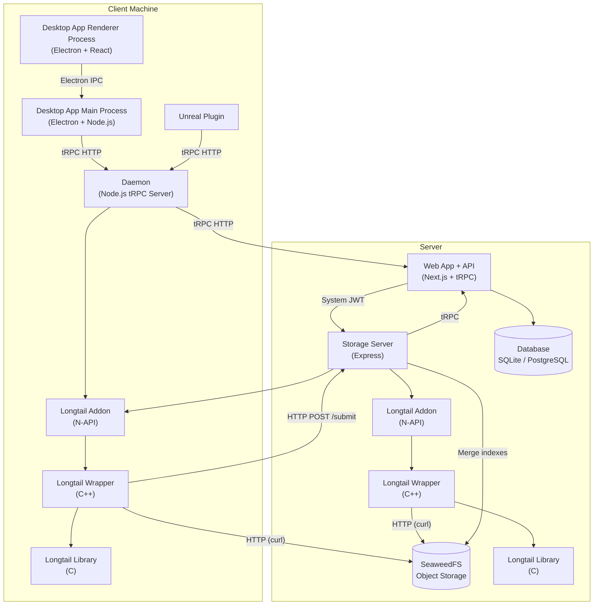
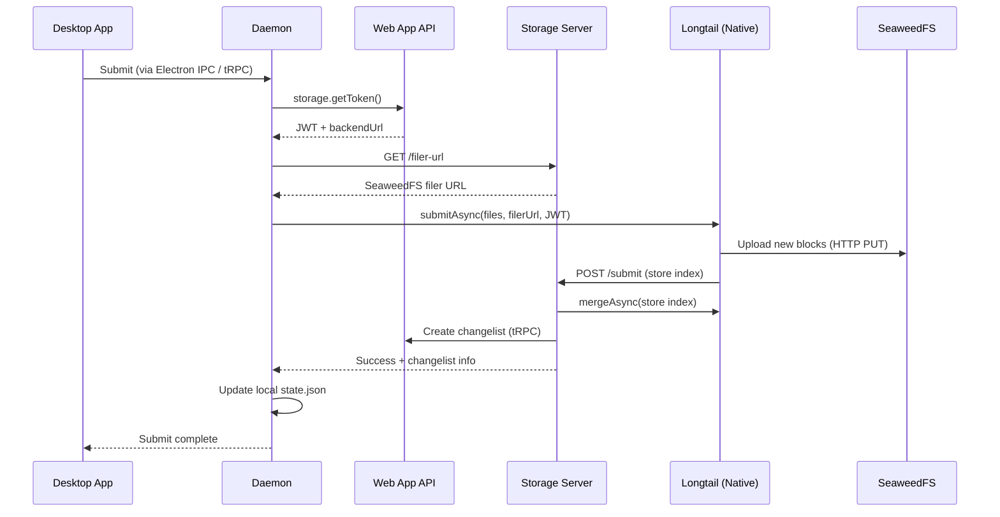
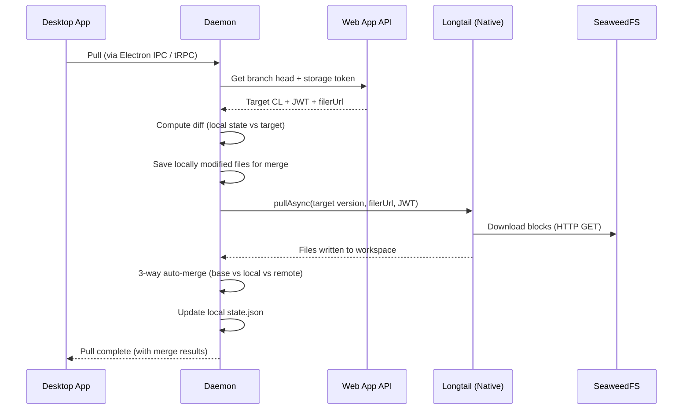

# Checkpoint VCS

Checkpoint is a version control system designed for large files and binary assets. It uses content-addressable chunked storage (powered by Longtail) with deduplication and compression, backed by SeaweedFS for distributed object storage. The system is composed of a web application, a local daemon, a storage server, native Longtail bindings, and client applications.

## Table of Contents

- [Quickstart (Development)](#quickstart-development)
- [Architecture](#architecture)
- [Configuration](#configuration)
- [License](#license)

## Quickstart (Development)

### Prerequisites

- Node.js (v20+)
- Corepack (ships with Node.js)

### Setup

```bash
git clone https://github.com/incanta/checkpoint.git
cd checkpoint
corepack enable
yarn
yarn build
```

### Running the Dev Environment

Start the web app, daemon, and storage server together:

```bash
yarn dev
```

This launches the two backend services (Next.js app with API and storage server) and the client daemon service and streams their logs. The script waits for each service to report healthy before declaring the environment ready.

To start the desktop Electron app separately (after `yarn dev` is running):

```bash
yarn desktop
```

### Individual Services

You can also run services individually if needed:

```bash
cd src/app && yarn dev       # Next.js web app (port 3000)
cd src/core && yarn daemon   # Local daemon (port 3010)
cd src/core && yarn server   # Storage server (port 3001)
```

## Architecture

Checkpoint is a monorepo containing several interconnected components. The system follows a layered architecture where client applications talk to a local daemon, which coordinates between the web API and the storage layer.

### Components

| Component            | Path                   | Description                                                                                                                                                                                                                                                                                                                                                |
| -------------------- | ---------------------- | ---------------------------------------------------------------------------------------------------------------------------------------------------------------------------------------------------------------------------------------------------------------------------------------------------------------------------------------------------------- |
| **Web App (API)**    | `src/app`              | Next.js application with a tRPC API. Manages users, organizations, repositories, branches, changelists, files, labels, and storage tokens. Uses Prisma with SQLite (dev) or PostgreSQL (prod). Acts as the central metadata authority.                                                                                                                     |
| **Daemon**           | `src/core/daemon`      | Node.js background process running on the developer's machine. Watches local workspaces for file changes, computes pending changes and sync status, and orchestrates submit/pull operations through Longtail. Exposes a tRPC HTTP API on localhost. All clients (desktop, game engines, etc) talk to the daemon instead of directly with backend services. |
| **Storage Server**   | `src/core/server`      | Express-based storage gateway sitting in front of SeaweedFS; includes a stub file server for SeaweedFS for most self-host scenarios. Handles version submissions by merging store indexes via Longtail, validates storage JWTs, and manages repo size calculations.                                                                                        |
| **Common**           | `src/core/common`      | Shared TypeScript library used across daemon, server, and client code. Contains API client helpers, auth utilities, and common types.                                                                                                                                                                                                                      |
| **Longtail Library** | `src/longtail/library` | The core Longtail C library. Implements content-addressable chunked storage with HPCDC chunking, blake2/blake3 hashing, and zstd/lz4/brotli compression. Generally not modified.                                                                                                                                                                           |
| **Longtail Wrapper** | `src/longtail/wrapper` | C++ wrapper around the Longtail C library. Provides higher-level functions for submit, pull, and merge operations. Includes a custom SeaweedFS storage API that reads/writes blocks via HTTP using curl.                                                                                                                                                   |
| **Longtail Addon**   | `src/longtail/addon`   | Node.js N-API addon that bridges JavaScript to the C++ wrapper. Exposes async functions (`submitAsync`, `pullAsync`, `mergeAsync`) that run Longtail operations in background threads.                                                                                                                                                                     |
| **Desktop App**      | `src/clients/desktop`  | Electron application with React UI. Provides a graphical interface for managing workspaces, viewing pending changes, browsing history, submitting versions, and pulling updates.                                                                                                                                                                           |
| **Unreal Plugin**    | `src/clients/unreal`   | Unreal Engine source control plugin that integrates Checkpoint directly into the Unreal Editor.                                                                                                                                                                                                                                                            |
| **SeaweedFS**        | `src/seaweedfs`        | A fork of SeaweedFS with custom modifications for Checkpoint's storage needs. Provides the distributed object storage backend **only in scalable scenarios**.                                                                                                                                                                                              |

### System Overview



### Data Flow: Submitting a Version



### Data Flow: Pulling / Syncing



### Longtail Native Stack

The Longtail integration is structured as a three-layer stack from C up to JavaScript:

```
 JavaScript/TypeScript  (@checkpointvcs/longtail-addon)
 Async wrappers: submitAsync, pullAsync, mergeAsync
            |
            v
 N-API Addon  (C++ - longtail-addon.cpp)
 Bridges JS objects to C++ functions, manages handle lifetimes
            |
            v
 C++ Wrapper  (longtail/wrapper/src/exposed/)
 submit.cpp, pull.cpp, merge.cpp - high-level operations
 Custom SeaweedFS StorageAPI (HTTP/curl)
            |
            v
 C Library  (longtail/library/)
 HPCDC chunking, blake2/3 hashing, zstd/lz4/brotli compression
 Block store, version index, content index
```

## Configuration

Checkpoint uses two distinct configuration systems depending on the component.

### Web App and Storage Server: YAML-based Config

The web app and storage server both use [`@incanta/config`](https://www.npmjs.com/package/@incanta/config), a YAML-based configuration library with environment-aware layering.

Each component has a `config/` directory structured as:

```
config/
  default/     # Base configuration (always loaded)
  dev/         # Development overrides (merged on top of default)
  prod/        # Production overrides
```

The active environment is selected via the `NODE_CONFIG_ENV` environment variable (e.g., `NODE_CONFIG_ENV=dev`). Values from the environment-specific directory are deep-merged on top of `default/`.

Config values are accessed via dot-notation paths:

```typescript
import config from "@incanta/config";
const port = config.get<number>("server.port");
const dbUrl = config.get<string>("db.url");
```

**Web App config** (`src/app/config/`):

- `auth.yaml` - Authentication settings: JWT secrets, OAuth providers (Auth0, GitHub, GitLab, Discord, etc.), dev login toggle
- `db.yaml` - Database connection URL (SQLite for dev, PostgreSQL for prod)
- `server.yaml` - Server port
- `storage.yaml` - Storage signing keys, token expiration, backend URL, filer settings
- `environment.yaml` - Maps environment variables to config paths (e.g., `DATABASE_URL` to `db.url`), allowing env vars to override YAML values

**Storage Server config** (`src/core/server/config/`):

- `server.yaml` - Host, port, TLS settings
- `seaweedfs.yaml` - SeaweedFS connection (master/filer hosts, ports), JWT signing keys, stub mode toggle for local dev
- `longtail.yaml` - Chunking parameters (chunk/block sizes), hashing algorithm (blake3), compression (zstd)
- `checkpoint.yaml` - Web app API URL for callbacks

### Daemon: JSON-based Config

The daemon uses its own JSON configuration system with multiple layers.

#### Global Daemon Config

**Location:** `~/.checkpoint/daemon.json`

Created automatically on first run. Controls global daemon behavior:

```json
{
  "workspaces": [],
  "logging": {
    "level": "info",
    "prettify": { ... },
    "logFile": {
      "enabled": true,
      "level": "info",
      "path": "logs/daemon.log"
    }
  },
  "daemonPort": 3010
}
```

#### Auth Config

**Location:** `~/.checkpoint/auth.json`

Stores authentication tokens per daemon instance. Managed by the common library's auth utilities.

The `workspaces` array tracks all registered local workspaces. The daemon reads and writes this file through the `DaemonConfig` singleton.

#### Per-Workspace Config

Each workspace tracked by Checkpoint has a `.checkpoint/` directory at its root containing several config and state files:

**`.checkpoint/workspace.json`** - Workspace identity and branch mapping:

```json
{
  "id": "workspace-uuid",
  "repoId": "repo-uuid",
  "branchName": "main",
  "workspaceName": "My Workspace"
}
```

**`.checkpoint/state.json`** - Tracks the current changelist number and the full inventory of tracked files with their hashes, sizes, and modification times. This file is managed by the daemon and should not be edited manually.

## License

Checkpoint is dual-licensed under the [Elastic License 2.0](./LICENSE.elastic) or [AGPLv3](./LICENSE.agpl). This means you can choose which license you want to operate under.

### Which license is best for me?

⚠️ **This is not legal advice; please seek your own legal counsel.** ⚠️

**For most people,** if you're only hosting/using Checkpoint for your own company/entity, and/or its subsidiaries, the [Elastic License 2.0](./LICENSE.elastic) should be more favorable for you. While it's not an official OSI license, it's very permissive with its [main limitation being "You may not provide the software to third parties as a hosted or managed service..."](./License.elastic#limitations).

If you want to "provide the software to third parties as a hosted or managed service", you must use the [AGPLv3](./LICENSE.agpl) license which is an [OSI-approved license](https://opensource.org/license/agpl-v3). This license has more limitations and conditions, which you should read in full **and** seek legal counsel for.
